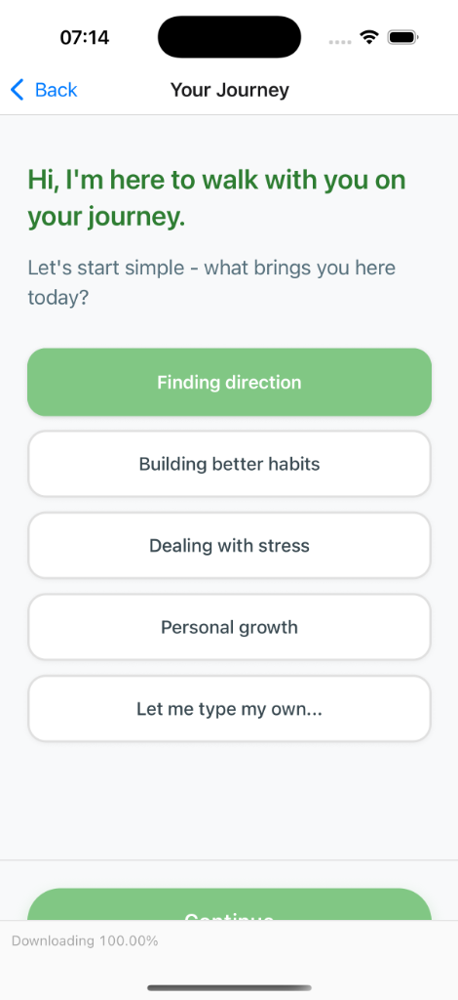
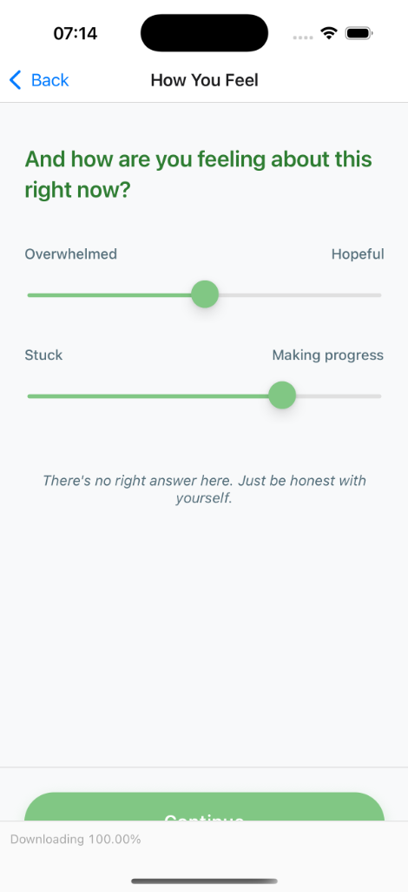
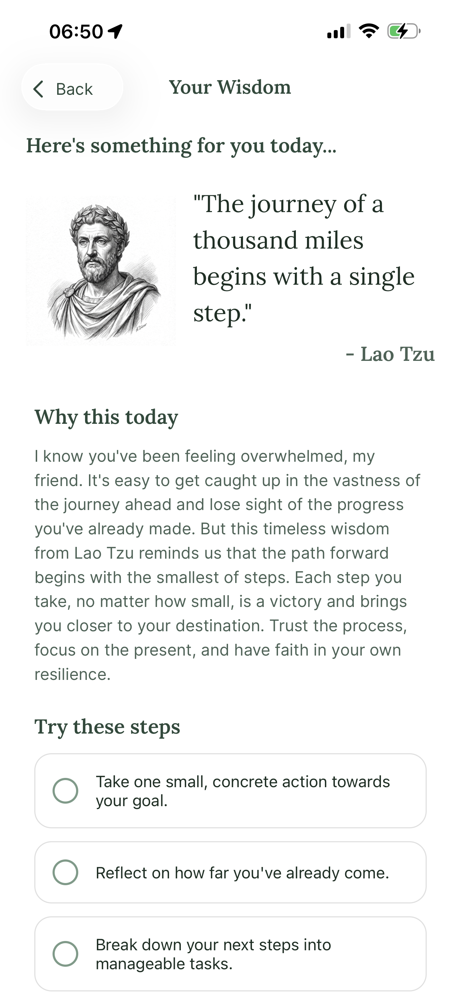

# Youth Wisdom

**Youth Wisdom** is a mobile application designed to be a daily living adviser for young people. It combines the timeless wisdom of famous quotes with modern AI coaching to help users navigate life's journey with purpose and confidence.

## Features

- **Bilingual Support**: Full English and Vietnamese language support with a top-right toggle on the Welcome Screen. The selected language persists throughout the entire user journey.
- **User Authentication**: Optional sign up/sign in with email and password powered by Supabase. Create an account to save favorites and manage your profile.
- **User Profiles**: Personalized profiles with avatar upload, gender, date of birth, and auto-calculated zodiac sign. Access your profile from any screen via the profile icon in the header.
- **AI Wisdom Coach**: A personalized onboarding flow with an intuitive grid-based selection interface for your current focus (Finding Direction, Building Habits, Dealing with Stress, Personal Growth).
- **Zen Mode**: A distraction-free custom input experience with smooth animations and background dimming for journaling your thoughts.
- **Emotion Tracking**: Share how you're feeling (Overwhelmed vs. Hopeful, Stuck vs. Making Progress) to get relevant advice.
- **Personalized Wisdom**: Uses the Claude API to curate famous quotes that speak directly to your current state, with language-specific tone (friendly and profound for Vietnamese).
- **Author Avatars**: Beautiful pen-and-ink sketch style portraits of philosophers and authors with multi-tier loading (local cache → GitHub CDN → AI generation) for optimal speed and cost efficiency.
- **Deep Insights**: Explains *why* this specific wisdom matters for you today in your selected language.
- **Actionable Steps**: Provides 3 simple, interactive steps you can take right now to embody the wisdom.
- **Minimalist Design**: A distraction-free interface with smooth animations that encourages you to sit with the wisdom.

## Screenshots

<div style="display: flex; flex-direction: row; gap: 10px; flex-wrap: wrap;">
  
  
  
  
</div>
</div>

## How it Works

1.  **Welcome**: Choose your preferred language (English or Vietnamese) from the Welcome screen.
2.  **Start**: Begin your journey with the selected language.
3.  **Context**: Select what you're focusing on from a grid-based interface or write your own custom thoughts in Zen Mode.
4.  **Emotion**: Use sliders to share how you're feeling right now.
5.  **Wisdom**: Receive a personalized famous quote in your selected language, a deep explanation of why it fits your state, and actionable steps.

## API Costs & Privacy

### Costs
- **Wisdom Generation**: `claude-3-haiku-20240307` model (~$0.0001 per generation, approx. 150 tokens)
- **Avatar Generation**: Multi-tier loading strategy minimizes costs:
  - **Tier 1**: Local cache (instant, $0)
  - **Tier 2**: GitHub CDN (fast, free) - 200+ pre-generated avatars at [youth-wisdom-avatars](https://github.com/aletuan/youth-wisdom-avatars)
  - **Tier 3**: Gemini 2.5 Flash Image API (~$0.01 per generation, only for rare/obscure authors)
- **Estimated Total**: <$5/month for 10k users (most avatars served from free CDN)

### Privacy
- User inputs (context and emotions) are sent to the Claude API for generation.
- No personal data is stored on Anthropic's servers beyond the API call.
- Avatar images are cached locally and served from public GitHub CDN.
- The app does not store your history permanently (yet).
## Getting Started

### Prerequisites

- Node.js
- npm or yarn
- Expo Go app (on your mobile device) or an iOS/Android simulator.
- **Anthropic API Key**: Required for wisdom generation.
- **Gemini API Key**: Optional, only used for generating avatars of rare/obscure authors not in the CDN.

### Installation

1.  Clone the repository:
    ```bash
    git clone <repository-url>
    cd hello-mobile
    ```

2.  Install dependencies:
    ```bash
    npm install
    ```

3.  **Configure API Keys**:
    - Create a `.env` file in the root directory (copy from `.env.example`).
    - Add your API keys:
      ```
      ANTHROPIC_API_KEY=sk-ant-your-key-here
      GEMINI_API_KEY=your-gemini-key-here  # Optional, only for rare avatar generation
      ```
    - **Note**: GEMINI_API_KEY is only used when an author's avatar is not found in the CDN. Most users will never trigger Gemini API calls.

### Running the App

1.  Start the Expo development server:
    ```bash
    npx expo start --clear
    ```

2.  Run on your device or simulator:
    - **Physical Device**: Scan the QR code with the Expo Go app.
    - **iOS Simulator**: Press `i` in the terminal.
    - **Android Emulator**: Press `a` in the terminal.

## Troubleshooting & Common Issues

### App Stuck on "Opening project..." or Timeout Error
If the Expo Go app on your phone gets stuck or shows a timeout error when trying to connect:

1.  **Check Network**: Ensure your phone and computer are on the **same Wi-Fi network**.
2.  **Use Tunnel Connection**: If the issue persists (often due to firewall or network isolation), try running the app with the `--tunnel` flag:
    ```bash
    npx expo start --tunnel
    ```
    *Note: This may require installing `@expo/ngrok` when prompted.*

### API Errors
If you see an error generating wisdom:
1.  Check that your `ANTHROPIC_API_KEY` is correct in `.env`.
2.  Ensure you have credits in your Anthropic account.
3.  Restart the server with `npx expo start --clear` to ensure environment variables are reloaded.

### Avatar Issues
If avatars fail to load:
1.  Most avatars are served from the free GitHub CDN (no API key needed).
2.  For rare authors not in the CDN, check that your `GEMINI_API_KEY` is correct in `.env`.
3.  Test CDN connectivity: `node scripts/test-avatar-cdn.js`

## Avatar Generation & Management

The app uses a multi-tier avatar loading strategy to minimize costs and maximize speed:

### Avatar System Architecture

1. **Local Cache** (instant, $0): Checks AsyncStorage and file system first
2. **GitHub CDN** (fast, free): Fetches from [youth-wisdom-avatars](https://github.com/aletuan/youth-wisdom-avatars) repository with 200+ pre-generated avatars
3. **Gemini API** (fallback, ~$0.01): Only for rare/obscure authors not in CDN

### Testing Avatar CDN
```bash
node scripts/test-avatar-cdn.js
```

### Generating New Avatars
Navigate to the separate avatar CDN repository:

```bash
cd scripts/avatar-cdn

# Generate all remaining avatars (skips existing)
node generate-batch.js

# Generate specific range (e.g., next 20 avatars)
node generate-batch.js --start=10 --limit=20

# Custom delay between API calls (default 1000ms)
node generate-batch.js --delay=2000
```

### Avatar Naming Convention
Authors are normalized to lowercase with special characters replaced by hyphens:
- "Marcus Aurelius" → `marcus-aurelius.png`
- "Søren Kierkegaard" → `soren-kierkegaard.png`
- "Lao Tzu" → `lao-tzu.png`

### Adding Avatars to CDN
1. Generate new avatars using the batch script
2. Commit and push to the youth-wisdom-avatars repository
3. Avatars are immediately available via GitHub Raw CDN
4. App automatically fetches from CDN on next request

## Technologies

- **React Native** (0.81.5) with **React** (19.1.0): For building the mobile UI.
- **Expo** (~54.0.25): For easy development and deployment.
- **React Navigation** (7.x): For seamless screen transitions.
- **Anthropic Claude API** (claude-3-haiku-20240307): For generating personalized wisdom and insights.
- **Google Gemini 2.5 Flash Image API**: For avatar generation (fallback only).
- **AsyncStorage**: For persistent language preferences and avatar caching.
- **expo-file-system**: For local avatar storage.

## License

This project is licensed under the MIT License.
